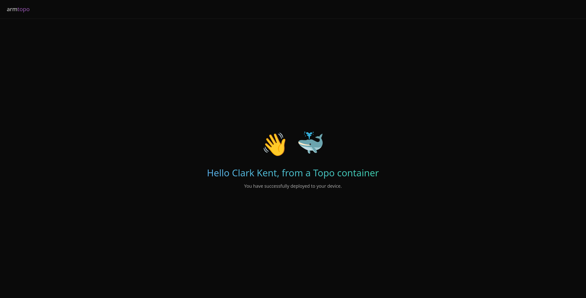

# Hello World

> This project is a [Topo](https://github.com/arm/topo) Template and follows the [Topo Template Format Specification](https://github.com/arm/topo-template-format).

A minimal "Hello, World" web app for validating a Topo setup and deployment.
It runs a single service that exposes a web page on the target,
with the greeting text customizable via the `GREETING_NAME` parameter.

This is the most basic Topo Template, intended as a starting point for understanding how a Topo Template is structured and how a simple containerized app is deployed to a target.

It demonstrates:
- Topo Template metadata and arguments defined under the `x-topo` section of `compose.yaml`.
- An HTML page that renders a customizable greeting.

Not sure what these terms mean? [Topo's glossary](https://github.com/arm/topo/blob/main/docs/glossary.md) defines many of its core concepts.

To find out more about the Topo Template Format, see [arm/topo-template-format](https://github.com/arm/topo-template-format).

## Usage

To use this Template, download and install `topo` from [arm/topo](https://github.com/arm/topo).

### Clone the Template:

```bash
topo clone git@github.com:Arm-Examples/topo-welcome
```

You will be prompted to provide an argument for 'GREETING_NAME'

```bash
The person to greet
Example: Markus
Default: World
GREETING_NAME (required)> Clark Kent
```

### Build and deploy the project:

```bash
cd topo-welcome
topo deploy --target <ip-address-of-target>
```

### What you will see

Once deployment completes, open a browser to `http://<ip-address-of-target>:8000` and you'll see a page that says "Hello <GREETING_NAME>, from a Topo container".


